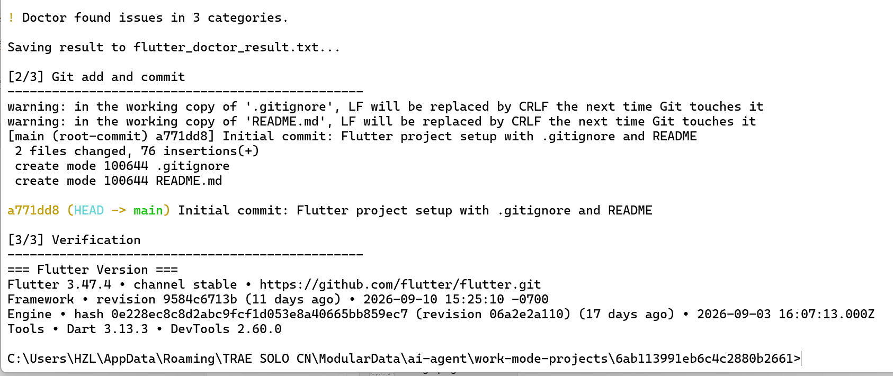
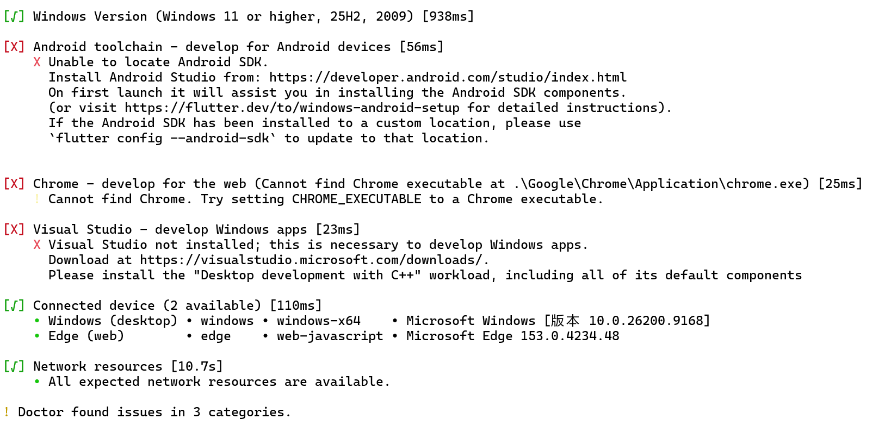
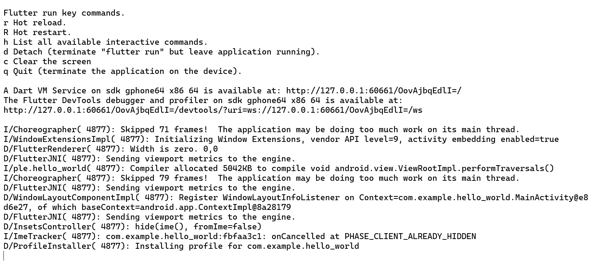

# Hello World - Flutter

第一个 Flutter 应用，支持 Android 模拟器、Web 端和 Windows 桌面运行。

## 运行环境

- Flutter 3.47.4 (stable)
- Dart 3.13.3
- Android SDK 35.0.0 / 36
- Visual Studio 2022 (C++ 桌面开发)
- Windows 11 25H2

## 运行方式

```bash
# 安装依赖
flutter pub get

# Web 端运行
flutter run -d edge

# Android 模拟器运行
flutter run -d emulator-5554

# Windows 桌面运行
flutter run -d windows
```

## 运行截图

### Flutter Doctor 全绿


### Web 端运行 (Edge)


### Android 模拟器运行


## 项目结构

```
hello_world/
├── lib/main.dart       # 应用入口 (runApp)
├── pubspec.yaml        # 依赖声明
├── android/            # Android 平台工程
├── web/                # Web 平台工程
├── windows/            # Windows 桌面工程
└── test/               # 测试
```

## 核心概念

- `runApp(const MyApp())` — 将根组件挂载到屏幕，是 Flutter 应用起点
- `Widget` — Flutter 中一切皆 Widget，描述界面的不可变配置树
